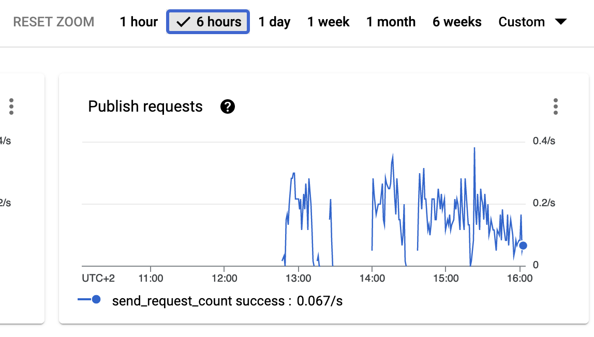
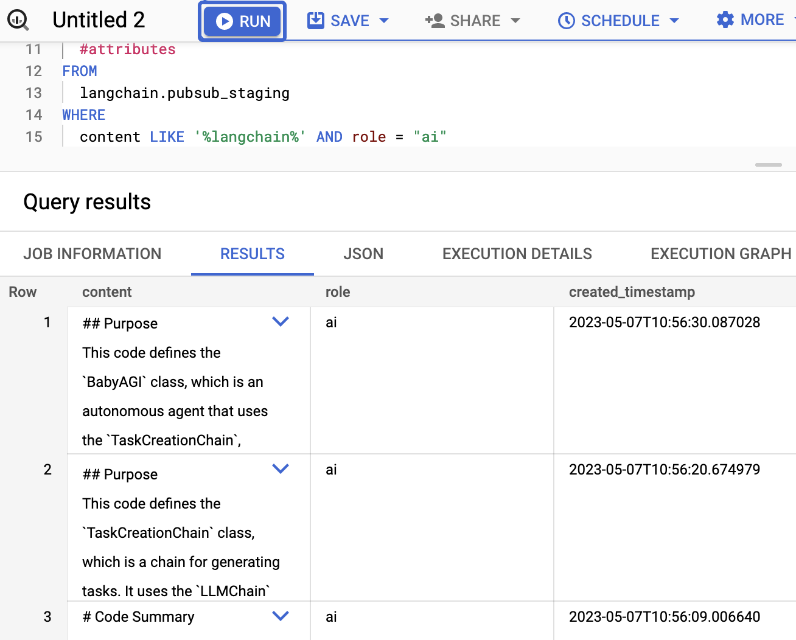
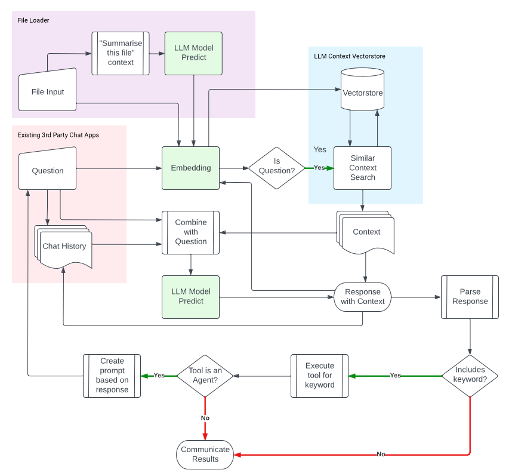
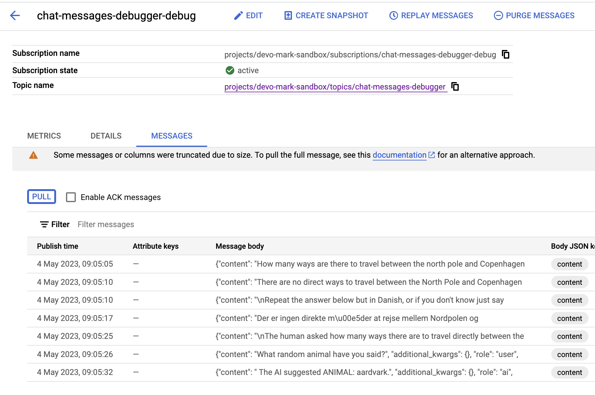

# Adventures in LLMs

All very much work in progress as I explore extending LLMs to some practical use cases enabled by [Langchain](https://python.langchain.com/en/latest/index.html).

There are currently three applications:

## PubSubChatMessageHistory

Publishing LLM input and output to PubSub, to give the LLM long term memory.  The PubSub stream can be used to stream data to BigQuery, trigger Cloud Functions etc.  This is done with the `PubSubChatMessageHistory` class derived from Langchains [BaseChatMessageHistory](https://github.com/hwchase17/langchain/blob/075d9631f58ac1603ca35cc11d1697355f543a96/langchain/schema.py#L218).  It also allows you to write the message history to disk in a JSON newline format suitable for BigQuery import, and saves the message history as you go to a [Chroma vectorstore](https://blog.langchain.dev/langchain-chroma/), allowing the message history to learn as it grows and be able to insert relevant history into prompts.

All the other applications use the above `PubSubChatMessageHistory` class as applications, and send in their respective messages to their own PubSub topics.  I then aggregate those into one BigQuery materialised table.

## Test file led Python code generation

Create Python code from a prompt and a python test file.  This is used to try and prevent hallucinations making unusable code when requesting it from LLMs.  As LLMs improve, this should become more and more reliable.  There is also an option to create the test file via LLMs, but with human intervention to check its ok before running the rest of the script. See its [README](code_generation/README.md)
```
python code_generation/create_script.py --help
usage: create_script.py [-h] prompt test_file output_file

Create a Python script from a prompt string and a test script

positional arguments:
  prompt       Prompt for the script, will be appended with a condition the script needs to pass the test passed to 'test'
  test_file    Path to the test_file.py you have created that the generated script will need to pass
  output_file  Path to where the output will be written. Needs to be in location your test_file.py will find it

optional arguments:
  -h, --help   show this help message and exit
```

## Q&A over a folder of files, use chat history as context

Do a QnA over a folder of files, by default Python files.  It creates summaries of those files via .md files in the same folder, and the chat history of those LLM calls and the QnA build up over time within the Chroma vectorstore to hopefully become more and more useful, as well as saved to BigQuery vai PubSub. See its [README](qna/README.md)

```

> ./qna/read_repo.py -h
usage: read_repo.py [-h] [--reindex] [--ext EXT] [--ignore IGNORE] [--resummarise] repo

Chat with a GitHub repository

positional arguments:
  repo             The GitHub repository on local disk

optional arguments:
  -h, --help       show this help message and exit
  --reindex        Whether to re-index the doc database that supply context to the Q&A (default: False)
  --ext EXT        Comma separated list of file extensions to include. Defaults to '.md,.py' (default: None)
  --ignore IGNORE  Directory to ignore file imports from. Defaults to 'env/' (default: None)
  --resummarise    Recreate the code.md files describing the code (default: False)
```

Some examples on how the LLM output ends in PubSub from indexing the langchain repository (https://github.com/hwchase17/langchain) can be seen below:

## Screenshots of GCP console after running scripts





## Data architecture for LLMs

My experiments in this repo have helped my identify the key components a production LLM application could hold.  I'm under active investigation on what tools would best help serve these roles.  Vector databases are key if you want to insert your own context into the prompts, as well as the type of model you are using to determine how many tokens you can include in the prompt, as well as of course its accuracy.

Agents and tools are an exciting development on top of LLM output, where you start to parse out templated responses to trigger new workflows, including creating new prompts to run iteratively through the LLM.



## global setup

To run the examples you could do this (I run off MacOS)

```bash
python3 -m venv env
source env/bin/activate
./env/bin/python3 -m pip install -r requirements.txt
```

Get an [OpenAPI key](https://platform.openai.com/account/api-keys) then put it in environment variables

```
echo 'export OPENAI_API_KEY=12345' >> ~/.zshenv
source ~/.zshenv
```

## Applications when you have a Cloud and local disk Long Term Memory class

All requests and responses are written in a manner they can be used downstream for further applications.

This opens up many use cases, initial thoughts on top ones are:
* An organization could have all usage of LLMs sent to one BigQuery database that accepts all LLM PubSub stream output. This could serve as an ever expanding searchable "company brain" that can be used to further tailor the LLM responses.  Message content can be used in answers themselves, for instance documents and knowledge locked up in domain experts could be inputted via a familiar UX such as Slack, Discord, GChat or a web based application.
*  Triggers can be configured by downstream GCP services that react to PubSub.  For instance, a Cloud Function can watch for LLM content that include a templated response e.g. if a LLM response includes a template: SQL: {the_sql} then it could run that query in Bigquery and email the results back to the user; if an LLM response includes a template keyword EMAIL: {email_content} then it could send an email etc. etc. 
* Set up scheduled summaries of LLM message content, and ask the LLM to speculate on the circumstances around the messages being sent and to what may happen next, then adding those to the message history labelled as dreams.

Messages are also stored into a vector database, so that they can be searched over to provide context to the LLM, which improves its responses for data that is not within its training set. At the moment this is a local version via Chroma, but it can be scaled up to use [Google Mathcing Engine](https://cloud.google.com/vertex-ai/docs/matching-engine/overview), that Langchain has recently integrated with ( https://github.com/hwchase17/langchain/pull/3104 )

## pubsub setup

Login to gcloud and init

```
gcloud config configurations activate default
gcloud auth login
```

You may need this if changed previously:

```
gcloud auth application-default login
```

```
# specify the GCP project you want to publish PubSub messages to, or it will take the gcloud default.
echo 'export GOOGLE_CLOUD_PROJECT=12345' >> ~/.zshenv

# location for where to save .json newline delimited messages
echo 'export MESSAGE_HISTORY=/Users/mark/dev/ml/chat_history/ >> ~/.zshenv
source ~/.zshenv
```

### Sending messages to PubSub

The example script below will save all messages to disk at the `MESSAGE_HISTORY` location; save message history to a Chroma database for QnA retrieval at `MESSAGE_HISTORY/chroma/.` (for adding context to prompts) and send messages to PubSub for use later on.

### Sending PubSub messages to BigQuery

The class will creates the PubSub topic if it doesn't already exist and publishes the message with any metadata and the time of creation.  You will need to set up a PubSub subscription to consume the messages - the easiest is a BigQuery sink.  I turn on metadata and set up the source BigQuery table via the schema found [here](bigquery/pubsub_bq_schema.json).

You can then make a view on top to parse out the message content, example [here](bigquery/pubsub_bq_view.sql):

```sql
CREATE MATERIALIZED VIEW  langchain.pubsub_staging AS (
SELECT 
    JSON_VALUE(SAFE.PARSE_JSON(data), "$.content") as content, # the LLM content
    JSON_VALUE(SAFE.PARSE_JSON(data), "$.role") as role,
    JSON_VALUE(SAFE.PARSE_JSON(data), "$.timestamp") as created_timestamp,
    JSON_VALUE(SAFE.PARSE_JSON(data), "$.additional_kwargs") as additional_kwargs,
    JSON_QUERY(SAFE.PARSE_JSON(data), "$.metadata") as metadata,
    SAFE.PARSE_JSON(data) as data_json,
    subscription_name,
    message_id,
    publish_time,
    attributes
  FROM  `langchain.pubsub_raw`
  WHERE DATE(publish_time) > "2023-04-13"
  AND SAFE.PARSE_JSON(data) IS NOT NULL
  )
```

The message data includes a "role" field which is either the human or ai response, and some additional metadata if appropriate that will probably help in the future filter the results. This is probably the scalable way to import historic messages.


### Code

The example code uses the PubSubChatMessageHistory class so that the chat history is sent to PubSub.  An example screenshot of the PubSub messages is below - once you have successfully run the script you should see similar in your GCP console here: https://console.cloud.google.com/cloudpubsub/topic/list



```python

import os
import my_llm.standards as my_llm
import openai
from langchain.chat_models import ChatOpenAI
from my_llm.langchain_class import PubSubChatMessageHistory

# swap out for any other LLM supported by LangChain
openai.api_key = os.environ["OPENAI_API_KEY"]
chat = ChatOpenAI(temperature=0.4)

# has methods memory.add_user_message() and memory.add_ai_message() that are used to write to disk and pubsub
# will create a pubsub topic "chat-messages-debugger"
memory = PubSubChatMessageHistory("debugger")

# clears any messages from local disk
memory.clear()

# the animal is random to demonstrate it is used in the context search later
prompt = "How many ways are there to travel between the north pole and Copenhagen directly? Also output a random animal with prefix: ANIMAL:"

# Uses a langchain ConversationChain as per /my_llm/standards.py
answer = my_llm.request_llm(prompt, chat, memory)

print(answer)

prompt2 = f"""
Repeat the answer below but in Danish, or if you don't know just say 'munch munch' a lot:
{answer}
"""

answer2 = my_llm.request_llm(prompt2, chat, memory)


# creates a summary message of the messages stored so far
summary = memory.apply_summarise_to_memory()

print("Summary")
print(summary)

# this vectorstore is stored only locally (for now)
memory.save_vectorstore_memory()

# it searches over the vectorstore, and inserts context into the prompt before sending the answer to LLM
answer3 = memory.question_memory("What random animal have you said?")
print(answer3)
```

(LLM generated summary)
> This code sets up an OpenAI chat model and uses it to generate responses to prompts. It imports several modules, including os, my_llm, and langchain. The code sets up an OpenAI API key and initializes a ChatOpenAI object with a temperature of 0.4. It also initializes a memory object with the namespace "debugger" and clears it. The code then generates a response to the prompt "How many ways are there to travel between the north pole and Copenhagen directly?" using the request_llm function from my_llm. It prints the response and generates a second response to a prompt that asks for a Danish translation of the first response. Finally, the code applies a summarization function to the memory object and prints the resulting summary. The memory object is then saved to a vector store.

## Bonus: Load Chat-GPT history from its export file

In Chat-GPT you can export your chat history as a json file.  There is a parser to load this so you can have it in a local json format, and save it into a vectorstore and publish them to PubSub.

The below example imports the history of when I was creating these scripts - we can see it answers about context that was only obtained through chat history for this library, after the training cutoff date.

```python
import os
import my_llm.standards as my_llm
import openai
from langchain.chat_models import ChatOpenAI
from my_llm.langchain_class import PubSubChatMessageHistory

# Set up OpenAI API
openai.api_key = os.environ["OPENAI_API_KEY"]

chat = ChatOpenAI(temperature=0.4)

memory = PubSubChatMessageHistory("debugger")
memory.clear()
# load chat-gpt history
memory.load_chatgpt_export("chatgpt_export/conversations.json")

summary = memory.apply_summarise_to_memory(n=10)

print("Summary last 10 messages")
print(summary)

answer3 = memory.question_memory("How is a TimedChatMessage defined?")
print(answer3)
```

### output:

```
Project ID: devo-mark-sandbox
Cleared memory
Loaded chatgpt_export/conversations.json into messages
Summary last 10 messages
```

> The human asks the AI to adjust a task so messages are published to Google PubSub when they are written to disk. The AI is asked to make pubsub_topic an optional variable when the class is created. The human also inquires about the purpose of the "memory_namespace: str" line in the class and whether it is necessary to be there. The AI is asked to adjust the task so that if pubsub_topic is not passed, it will create the pubsub_topic from memory_namespace.
 
 > A TimedChatMessage is an object that contains a message and a role (e.g. "user") that is used in the BaseChatMessageHistory class and its subclasses.


