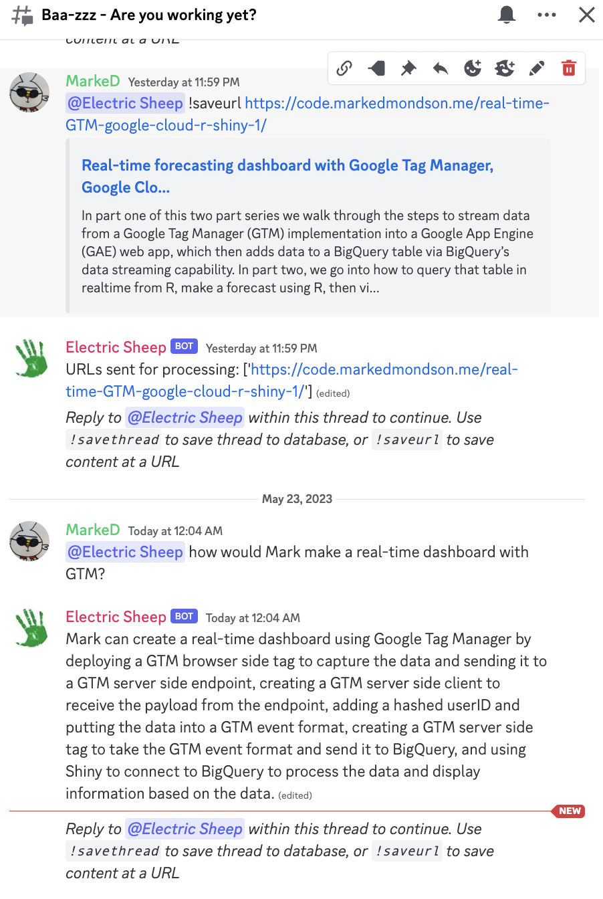

# Discord bot

A bot that can be used within Discord.

Discord is good because its a nice UX to use to load and discuss your files:



## Setup

1. Add the bot to the Discord server via this link:

1. Add bot to the channels you want it to use within the server
1. Setup the Supabase tables and functions - example below for `fnd`

```sql
-- Enable the pgvector extension to work with embedding vectors
       --create extension vector;

       -- Create a table to store your documents
       create table fnd (
       id bigserial primary key,
       content text, -- corresponds to Document.pageContent
       metadata jsonb, -- corresponds to Document.metadata
       embedding vector(1536) -- 1536 works for OpenAI embeddings, change if needed
       );

       CREATE FUNCTION match_documents_fnd(query_embedding vector(1536), match_count int)
           RETURNS TABLE(
               id bigint,
               content text,
               metadata jsonb,
               -- we return matched vectors to enable maximal marginal relevance searches
               embedding vector(1536),
               similarity float)
           LANGUAGE plpgsql
           AS $$
           # variable_conflict use_column
       BEGIN
           RETURN query
           SELECT
               id,
               content,
               metadata,
               embedding,
               1 -(fnd.embedding <=> query_embedding) AS similarity
           FROM
               fnd
           ORDER BY
               fnd.embedding <=> query_embedding
           LIMIT match_count;
       END;
       $$;
```

1. Add to config file:

```json
{
	"Mark Edmondson": "edmonbrain",
	"Illys Shield": "fnd"
}
```

1. Create a dead letter topic/sub that will write failed messages to BigQuery.  This prevents the message trying forever and running up bills.  Assign this dead letter topic to all PubSub instances below. 

The app will create all the PubSub topics and subscriptions necessary upon the first call to the app with a new vectorname - they are mapped out as below.  They are one to many, so it will allow parallel processing of document chunks that speeds it up significantly.

/discord/<vector_name>/files --> pubsub_topic="app_to_pubsub_<vector_name>" --> pubsub_sub="pubsub_to_store_<vector_name>  -->
/pubsub_to_store/<vector_name> --> pubsub_topic="embed_chunk_<vector_name>" --> pubsub_sub="pubsub_chunk_to_store_<vector_name> -->
/pubsub_chunk_to_store/<vector_name> --> supabase db_table=<vector_name>

## Supabase

Improving the documents returned is a matter of improving the SQL query
https://supabase.com/blog/openai-embeddings-postgres-vector

For instance, you can add a threshold for the similarity score (0.5 in below example)

```sql
CREATE OR REPLACE FUNCTION match_documents_fnd(query_embedding vector(1536), match_count int)
           RETURNS TABLE(
               id bigint,
               content text,
               metadata jsonb,
               -- we return matched vectors to enable maximal marginal relevance searches
               embedding vector(1536),
               similarity float)
           LANGUAGE plpgsql
           AS $$
           # variable_conflict use_column
       BEGIN
           RETURN query
           SELECT
               id,
               content,
               metadata,
               embedding,
               1 -(fnd.embedding <=> query_embedding) AS similarity
           FROM
               fnd
           where 1 - (fnd.embedding <=> query_embedding) > 0.5
           ORDER BY
               fnd.embedding <=> query_embedding
           LIMIT match_count;
       END;
       $$;
```