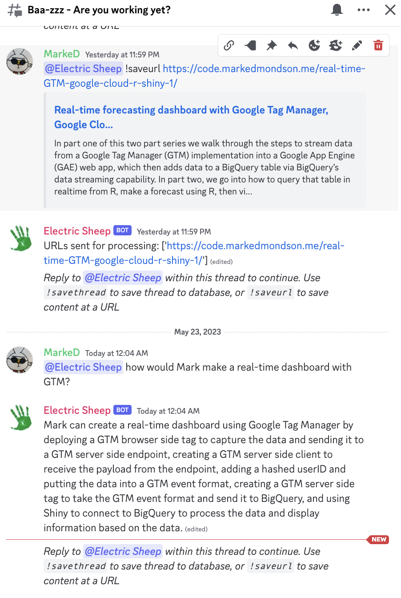
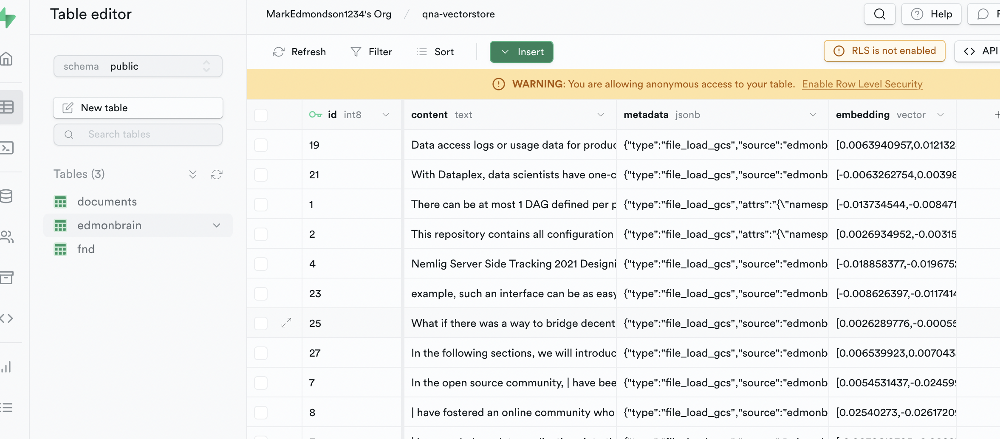
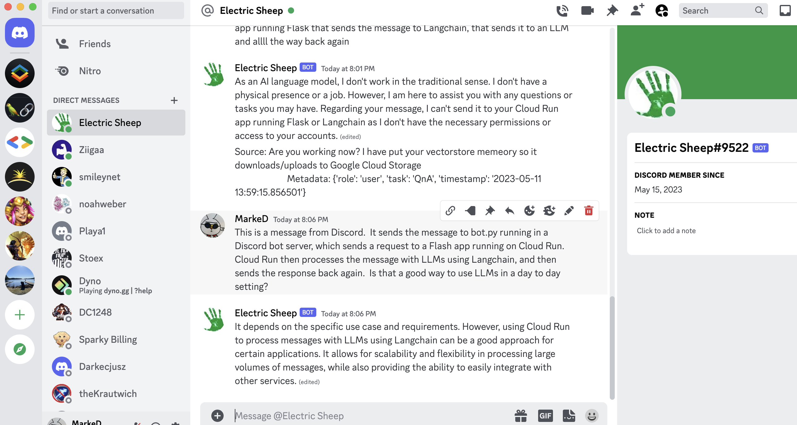
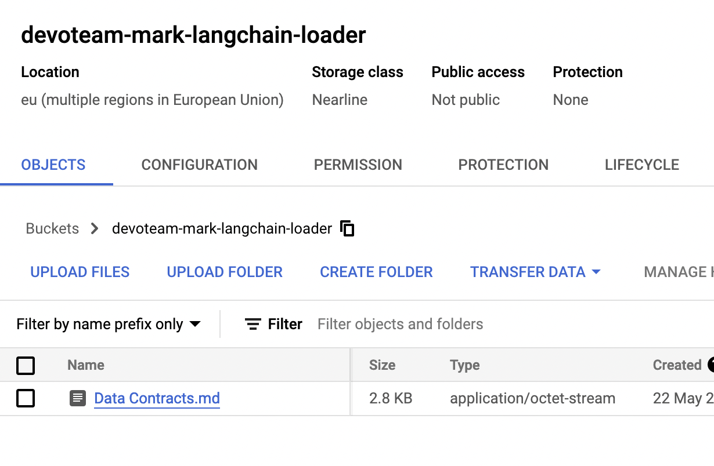

# UX for EdmonBrain

This is an exploration on how to interact with the LLM tools in this repo.  It includes a Flask app that is deployed to Cloud Run, for 0 to 1000+ scale.  Each individual cloud Run instance needs to process a file, but can't do multiple files at once.  To work around the need for vertical scaling, a document is broken into chunks using the Langchain loaders for various file formats.  Each document is chunked and then sent to its own PubSub message topic.  That topic sends the content back to the app in another process, so it can scale up and down as required.  Once the app has embedded the document chunk via OpenAI, it sends the data to a Supabase vectorstore. 

The LLM embedding, document loaders, vectorstore can be swapped out fairly easily by using the appropriate Langchain functios.

For QnA over the doucments using the vectorstore there is also an endpoint explained in [that folder](../qna/README.md).

## Triggers

The back end of PubSub/CloudRun can be triggered in various ways via a HTTP call to `/pubsub_to_store/<vector_name>`, where <vector_name> is a namespace that can be used to import into several different vectordatabases via the same app. Currently the triggers are:

* Flask web app run locally 
* Discord bot (allowing use of Discord's caht history and file handling)
* Google Cloud Storage bucket - files added can be configured to trigger a PubSub message foramt that `/pubsub_to_store/<vector_name>` supports.

Discord is good because its a nice UX to use to load and discuss your files:



TODO:

* Slackbot
* GChat

## Supabase

The embeds are routed to Supabase, but can be swapped out for another vectorstore by adjusting the Langchain functions.  You can see how to configure Supabase [via this README file.](../discord/README.md)




## Deploy to Cloud Run

Deploy the app to Cloud Run by using Cloud Build as shown below. 

### Add secrets to Secret Manager

These secrets are needed to be available to Cloud Build so it can add them at build time to the deployed Cloud Run instance.

* OPENAI_API_KEY - from openai
* SUPABASE_KEY - for Supabase deployments
* SUPABASE_URL - the Supabase URL you want to use
* DB_CONNECTION_STRING - the Supabase postgres connection string if you want it to set up the database for you


### IAM

Use default service account, or better is use a dedicated service account with these permissions

e.g. `your-app@your-project.iam.gserviceaccount.com`

* Pub Sub Editor
* Storage Admin

### Run Cloud Build

Run from the root directory of this repository

```
gcloud builds submit --config cloudbuild.yaml . \
  --substitutions=_IMAGE_NAME=edmonbrain,_SERVICE_NAME=edmonbrain-app,_REGION=europe-west3,_GCS_BUCKET=bucket-to-store-vectorstore,_SERVICE_ACCOUNT=your-service-account@your-project.iam.gserviceaccount.com
```

Or preferably set up a Cloud Build Trigger for each git commit.
* cloudbuild.yaml is a longer running build for making the Docker image needed for the Cloud Run
* cloudbuild_cloudrun.yaml only copies across the files and deploys to Cloud Run without needing to install pip libaraires and system stuff too


## WebApp

Can be used to configure the vectorstore index

Run locally:

```
./env/bin/python3 ./webapp/app.py   
```

Give its service account running the Cloud Run Cloud Storage read/write permissions if you supply the _GCS_BUCKET

## Discord bot

Can accept inputs, outputs, proviides chat history and can upload limited files

Register a new bot with Discord.com

1. Make a new Discord application: https://discord.com/developers/applications
1. Create a new Bot under that application
1. Generate DISCORD_TOKEN to put in the bot.py script via .env
1. Go to OAuth2 > URL Generator to create an invite link and save it somewhere safe
1. Click on invite link and add the bot to your own Discord server

Need a seperate Discord bot hosting service with a bot that will call the Cloud Run URL.

I deploy mine from this repo https://github.com/MarkEdmondson1234/discord-bot

1. Create a config file that will look up your Discord server name and determine which brain to use:

```
{
	"Mark Edmondson": "edmonbrain",
	"Another Discord Server": "blah.com"
}
```

1. Upload bot.py, config.yaml, requirements.txt and .env to the Discord bot server
1. Verify bot server is running

Discord bot will need to be mentioned via @ElectricSheep to get data sent to the bot



## PubSub Routing

The PubSub topics and subscriptions should all be created automatically upon first message sent. 

1. the first document attempted to load will create a pubsub topic `app_to_pubsub_<vector_name>` with a subscription `pubsub_to_store_<vector_name>` that pushes data to https://your-cloudrun-app.a.run.app/pubsub_to_store/<vector_name>
1. pubsub_to_store will chunk u the document and send the pieces to another pubsub topic for parellel processing
1. Parallel processing will be done via a created topic called `embed_chunk_<vector_name>` and a subscription called `pubsub_chunk_to_store_<vector_name>` that pushes data to https://your-cloudrun-app.a.run.app/pubsub_chunk_to_store/<vector_name>

/discord/<vector_name>/files --> pubsub_topic="app_to_pubsub_<vector_name>" --> pubsub_sub="pubsub_to_store_<vector_name>  -->
/pubsub_to_store/<vector_name> --> pubsub_topic="embed_chunk_<vector_name>" --> pubsub_sub="pubsub_chunk_to_store_<vector_name> -->
/pubsub_chunk_to_store/<vector_name> --> supabase db_table=<vector_name>

## Cloud Storage files to embed vector database

Make a PubSub topic fire for each file added by adding it to your own cloud storage bucket and aim it at `app_to_pubsub_<vector_name>`.  Easiest is one bucket per vector store. 

e.g.

```
gcloud storage buckets notifications create gs://devoteam-mark-langchain-loader --topic=app_to_pubsub_<vector_name>
```

Now every file added to the cloud storage bucket will trigger a pipeline of loading it as a document, splitting it up into chunks, embedding them and sending to the vector database.



By default it will use the vector_name you have specified, but that will be overwritten if there is any directory structure to the bucket with the vectorname being the name of the first folder within the bucket e.g. marksbrain/text1.txt will create a "marksbrain" vector database.   Files writted to the bucket with a vectorname specified will follow this strucutre too. 

## Slackbot

Can only accept inputs and outputs

```
echo 'export SLACK_BOT_TOKEN=XXXX' >> ~/.zshenv
source ~/.zshenv
```